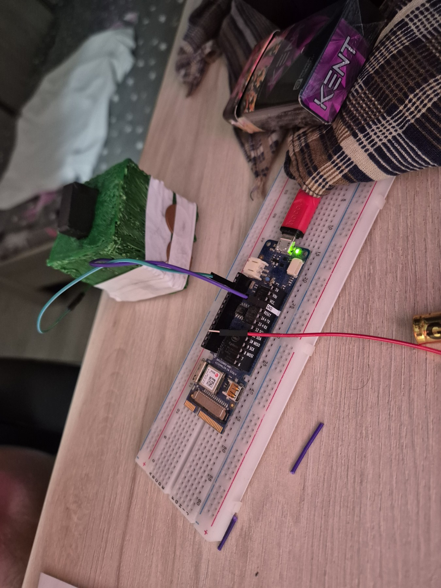
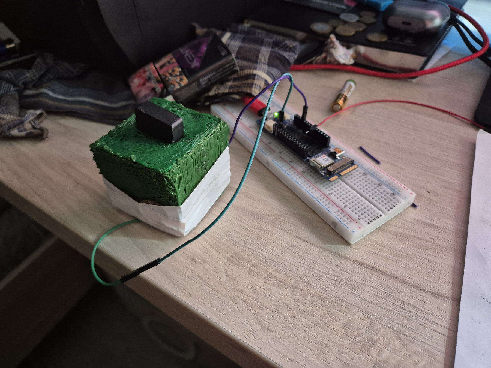

# Интерфейс мозг-компьютер беспроводной (ИМКБ).
# RealTimeGraph: Интерфейс Человек–Машина на самодельном сенсоре

**RealTimeGraph** — это десктопное приложение на C++ (MFC), которое реализует интерфейс взаимодействия человека и машины через анализ микросигналов с полностью самодельного аналогового сенсора.

> **Философия проекта:** «Хороший интерфейс реагирует не на действие, а на намерение».  
> Система не читает мысли напрямую. Она детектирует физиологические микрореакции (мышечное напряжение, микродвижения), которые возникают до или одновременно с принятием решения.

---

## Идея и принцип работы

Система состоит из двух частей: **физического сенсора** и **программного детектора паттернов**.

### Самодельный сенсор (физика процесса)

Сенсор собран полностью вручную из доступных компонентов:

*   **Основа:** небольшая коробочка.
*   **Активный материал:** графитовые стержни из батареек (дают переменное сопротивление).
*   **Источник энергии:** 10 элементов AAA + 2 элемента A.
*   **Ключевой элемент:** магниты внутри корпуса 3 шт.
*   **4 медные монеты по 5 коп.:** монеты примотаны изолентой, своего рода клещи для снятия напряжения.

**Как это работает:**  
При изменении энергии в системе атомы графита начинают «выбиваться» и под действием магнитного поля концентрируются у полюсов. Это вызывает крайне малые, но измеримые колебания тока. Изначально сигнал пытались усиливать транзистором, но его амплитуды не хватало. Решение нашлось в использовании аналоговых пинов Arduino (в проекте — Vidor 4000), способных фиксировать малейшие колебания напряжения.

### Программная часть (MFC + корреляция)

Десктопное приложение (MFC) делает следующее:

1.  **Чтение данных:** асинхронное чтение с COM‑порта без блокировки интерфейса (отдельный поток).
2.  **Протокол:** запрос `SEND_DATA` → ответ `OK,<raw>,<volts>`.
3.  **Детектирование намерений:**
    *   Режим записи шаблона: пользователь выполняет действие, система сохраняет форму волны (вектор значений).
    *   Мониторинг: в реальном времени вычисляется коэффициент корреляции между текущим сигналом и сохранёнными шаблонами.
4.  **Реакция:** при превышении порога схожести (по умолчанию 0.85) система:
    *   Подаёт звуковой сигнал.
    *   Записывает событие в лог (`sensor_alerts.log`) с временной меткой.
    *   Отправляет команду `ALERT` обратно на Arduino.
5.  **Визуализация:** отрисовка графика сигнала средствами GDI.

---

## Возможности

*   **Мониторинг в реальном времени:** график сигнала обновляется каждые 50 мс.
*   **Обучение паттернов:** пользователь может вручную записать эталонную форму сигнала для конкретного действия/намерения.
*   **Корреляционный поиск:** система ищет совпадения формы волны, а не абсолютных значений (устойчива к изменению амплитуды).
*   **Статистический анализ:** расчёт регрессии, R², асимметрии и других метрик для выявления аномалий.
*   **Логирование:** события сохраняются в файл с временной меткой (режим Append).
*   **Двусторонняя связь:** приложение может отправлять управляющие команды на Arduino.

---

## Сборка и запуск

### Требования

*   ОС: Windows.
*   Среда разработки: Visual Studio (с поддержкой MFC).
*   Платформа: x64 (или x86, при необходимости).

### Сборка проекта

1.  Откройте решение `.sln` в Visual Studio.
2.  Убедитесь, что проект настроен на использование MFC (статически или динамически).
3.  Нажмите **Сборка → Перестроить решение** (Build → Rebuild Solution).

### Запуск

1.  Подключите Arduino к компьютеру и определите номер COM‑порта.
2.  Запустите скомпилированный `.exe`.
3.  Введите номер порта (например, `3` для COM3) в поле ввода.
4.  Нажмите **«Подключить»**, затем **«Старт»**.

---

## Использование

1.  **Подготовка шаблона:**
    *   В поле «Имя шаблона» введите название (например, «РезкийСкачок»).
    *   Нажмите **«Начать запись шаблона»**.
    *   Выполните целевое действие (движение, напряжение мышц и т.д.), чтобы сенсор зафиксировал характерный сигнал.
    *   Система автоматически сохранит шаблон после сбора необходимого количества точек.
2.  **Мониторинг и реакция:**
    *   При повторении действия система сравнит текущий сигнал с шаблоном.
    *   Если коэффициент корреляции превысит порог (по умолчанию 0.85), сработает тревога: звуковой сигнал, запись в лог и команда на Arduino.
3.  **Калибровка**
    *   Для начала попробуйте то что вызывает дисосанс: порно, гейпорно, медитация.

## Медиа

 

 

